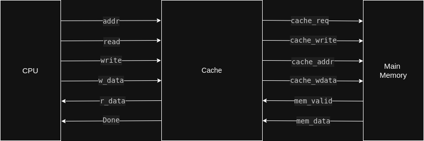

# 🧠 2-Way Set-Associative LRU CPU Cache 

## 🧾 Overview
This project implements a 2-way set-associative CPU cache using the Least Recently Used (LRU) replacement policy in Verilog. The cache is designed to optimize memory access performance in CPU systems by reducing latency and memory bandwidth usage.

The design aims to reflect realistic CPU-memory interactions, including block refill, write-back handling, hit/miss resolution, and LRU-based replacement.

---

## 🔍 What is a 2-Way Set-Associative Cache?
A 2-way set-associative cache splits the cache into multiple sets, with each set containing 2 blocks (ways). An incoming memory address maps to one specific set, and the cache logic checks both blocks in that set for a tag match (i.e., a hit).

This architecture offers a good balance between complexity and performance:

- More flexible than direct-mapped caches (reduces conflict misses).
- Less hardware-intensive than fully associative caches.

---

## 🧠 LRU Replacement Policy
To maintain optimal cache utilization, the cache employs the Least Recently Used (LRU) replacement strategy:

- Each set maintains an LRU bit to indicate the least recently accessed block.
- On a cache miss, the block marked as LRU is evicted and replaced.
- On a cache hit, the LRU bit is updated to reflect recent usage.

This strategy helps in retaining more frequently accessed data in the cache, improving hit rate and overall performance.

---

## ✅ Features
- 2-Way Set Associativity  
- LRU (Least Recently Used) Replacement  
- Configurable Data, Address & Block Widths  
- Write-Back & Write-Allocate Policies  
- Dirty Bit Tracking for Cache Blocks  
- Simulated Main Memory with Optional Initialization  
- Synthesizable Verilog RTL  
- Self-Contained Testbench for Simulation & Debugging  

---

## 🧩 Parameters

| Parameter       | Description               | Default Value |
|-----------------|---------------------------|---------------|
| ADDRESS_WIDTH   | Address bus width         | 8             |
| DATA_WIDTH      | Width of a word           | 32 bits       |
| BLOCK_SIZE      | Size of one cache block   | 128 bits      |
| INIT_MEM        | Enable memory initialization | 1 (enabled) |

---

## 🔧 How It Works

### Address Decomposition
Incoming addresses are divided into:  
- **tag:** to uniquely identify data  
- **index:** to locate the set  
- **offset:** to access a word within a block  

### Lookup
- Both blocks (ways) in the indexed set are checked for tag match and valid bit.

#### Hit:
- Data is returned directly.
- LRU bit is updated to mark this way as recently used.

#### Miss:
- If the LRU-marked block is dirty, it is written back to main memory.
- The block is then refilled from memory and replaces the LRU block.

### Write Handling
- Follows **write-back** (only write to memory on eviction).
- Follows **write-allocate** (on write miss, block is first brought into cache).

---

## 🧱 Architectural Diagram
Below is the architectural layout of the design showing connections between CPU, Cache, and Main Memory:

